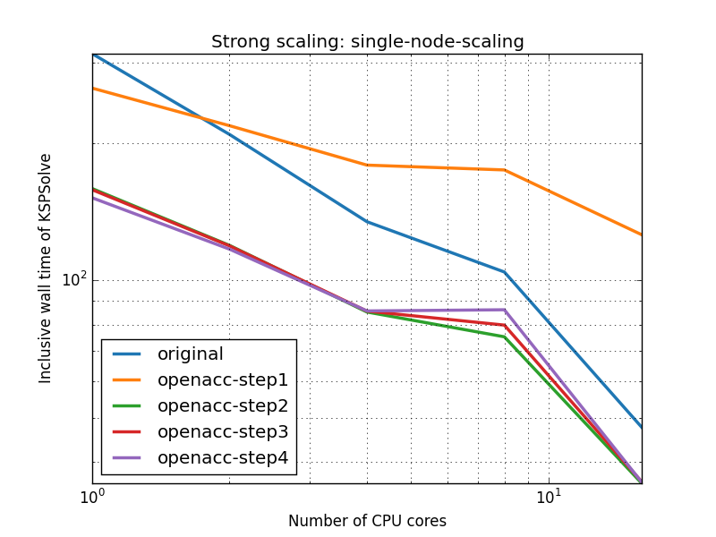
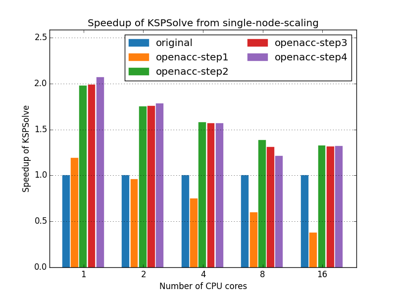
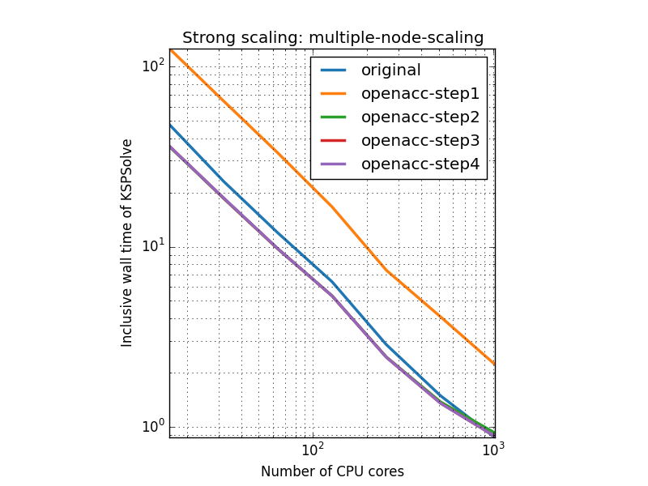
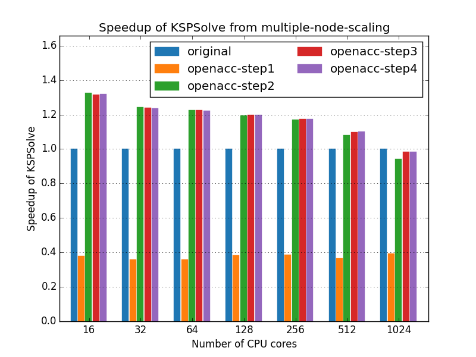

# PETSc-OpenACC

This project demonstrates the feasibility of migrating legacy PETSc-based 
applications to modern supercomputers (which are often heterogeneous platforms)
with minor code modifications in PETSc's source code.

## Introduction
------------------------------

[PETSc](https://www.mcs.anl.gov/petsc/) (Portable, Extensible Toolkit for
Scientific Computation) is an MPI-based parallel linear algebra library. It has 
been used to build many scientific codes in HPC (high-performance computing) 
area for over two decades. While PETSc provides excellent performance on CPU 
machines, it still lacks satisfying GPU support. Nowadays, GPU plays an 
increasingly important role in modern supercomputers, and due to PETSc's lagging
GPU support, PETSc-based applications may need to find other ways to move 
forward in hybrid accelerated systems.

This project demonstrates that it's not difficult for PETSc users to enable
GPU capability. Minor code modifications in PETSc's source code can achieve
that. Directive-based programming models, such as OpenACC, are suitable for this
kind of minor coding works.

The speedup may not be appealing in this way because we avoid re-designing
numerical methods and parallel algorithms. The sequential kernels called by
each MPI process in PETSc are originally designed for a single CPU core. Thus,
naively inserting OpenACC directives into source code may not be able to hide
data transfer latency efficiently. And some kernels are difficult to be
parallelized without re-designing their algorithms. 

Nevertheless, small speedups can still be useful to codes running on some
supercomputers, such as Titan and Summit. These supercomputers only provide
hybrid nodes (i.e., CPU + GPU). Hence, for PETSc applications running on
those supercomputers, minor code modification in an exchange with GPU 
capability and a small speedup may be acceptable. It's all about a balance
between coding effort and computational performance.

## Description
------------------------------

* Target problem: a 3D Poisson problem, which represents a bottleneck of many
  CFD (computational fluid dynamics) codes.
* The KSP linear solver will be CG (conjugate-gradient method) + GAMG (algebra
  multigrid preconditioner)
* Target platform: [Titan](https://www.olcf.ornl.gov/computing-resources/titan-cray-xk7/)

In order to avoid potential license issues, all code snippets from PETSc are
left out. Instead, patch files are used to create OpenACC kernels by patching
original PETSc source code. Once users use command `make build-petsc` to
download and build PETSc, the command will automatically extract necessary PETSc
kernel functions to directory **src/original**. And it will next patch these
PETSc kernels to create OpenACC kernels, which will be located in
**src/openacc-step[1-4]**.

In folder `runs`, there are some PBS scripts for running some tests/benchmarks 
on Titan. Users can submit these PBS jobs through `make` or `qsub` directly. But
jobs must submit under the top-level directory of this repo, because there are
some relative paths used. See the usage below.

## Usage
------------------------------

At top-level directory:

* `source ./scripts/set_up_environment.sh`: setup the environment on Titan
* `make help`: see help
* `make list`: list all targets
* `make list-executables`: list all targets for building executables
* `make list-runs`: list all targets for submitting PBS jobs
* `make build-petsc`: build PETSc library, extract necessary PETSc kernels to
  **src/original**, and then create OpenACC kernels in **src/openacc-step[1-4]**
* `make all`: build all executables
* `make <executable>`: build an individual executable
* `make PROJ=<chargeable project> PROJFOLDER=<usable folder under $MEMBERWORK> <run>`: 
  submit a run shown in `make list-runs` using the allocation of 
   *\<chargeable proj\>*; or you can use alternative command `qsub -A
  <chargeable project> -v PROJFOLDER=<usable folder under $MEMBERWORK>,EXEC=<executable>
  runs/<PBS script>.pbs`. `PROJFOLDER` will be used as a temporary working directory.
* `make clean-build`: clean executables and object files
* `make clean-petsc`: clean build PETSc library
* `make clean-all`: clean everything
* `make create-plots`: create plots for strong scaling and speedups according to result
  files under the folder **runs**. Must get some results (e.g. run some PBS jobs first)
  prior calling this target.

## Example Results on Titan
------------------------------
Results from a 300x300x300 Poisson problem. For single-node tests, 1, 2, 4, 8, and 16 CPU
cores and 1 K20x GPU were used on a Titan node. For multiple-node tests, 1, 2, 4, 8, 16,
32, and 64 Titan nodes were used (16 CPU cores + 1 K20x GPU per node).

## Contact

Use GitHub issue or email: <pychuang@gwu.edu>
